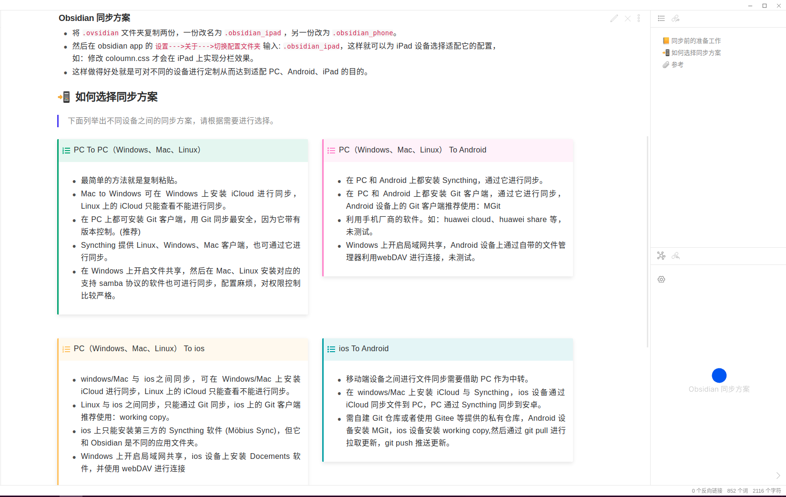

# :tada: obsidian_orange 是什么？
- obsidian_orange 是一款基于 `minimal theme ` 定制的主题。

## :sparkles: obsidian_orange 实现了什么功能？
- 多样式“提示块”
- 图片并列显示
- 高亮块 & 文本多颜色高亮
- 徽章（Badge）：在标题或文本的右上角添加状态信息
- 自动 fetch url 标题并填充为 markdown 格式
- 以卡片形式显示 inbox 中待整理的笔记
- 笔记两栏、三栏布局

## :triangular_flag_on_post: 推荐安装的插件
- [obsidian-admonition](https://github.com/valentine195/obsidian-admonition)
- [obsidian-auto-link-title](https://github.com/zolrath/obsidian-auto-link-title)
- [obsidian-folder-note-plugin](https://github.com/xpgo/obsidian-folder-note-plugin)

## :point_right: 如何使用 ?
- 下载本项目
- 用 obsidian 打开 obsidian_orange
- 仔细阅读 `Start Here` 文件，想查看具体语法如何使用可打开 `编辑模式`，这样就可查看完整的语法使用技巧。
- 关闭 obsidian 0.13.14 所见即所得：选中 **设置---> 编辑器---> use legecy editor**

## :framed_picture: 效果预览

