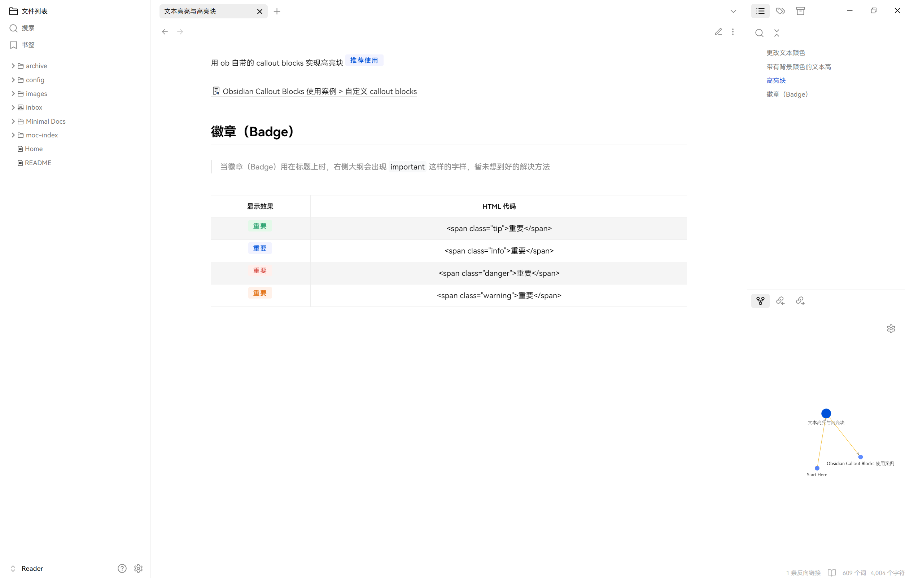
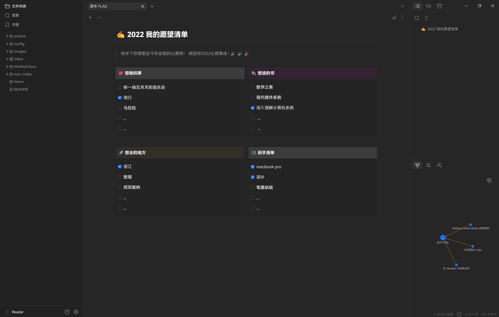
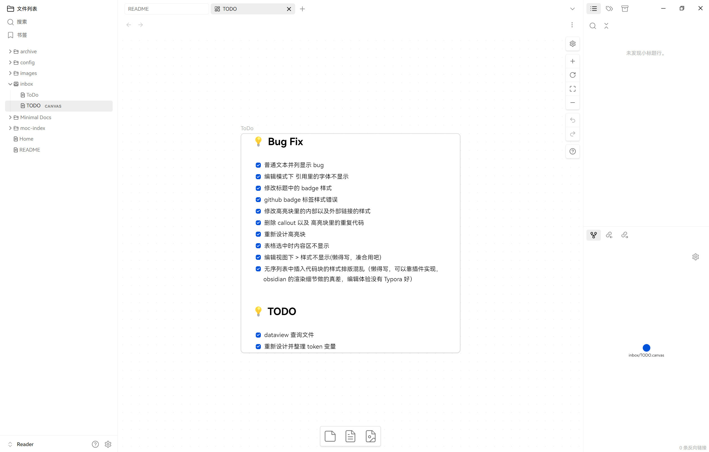
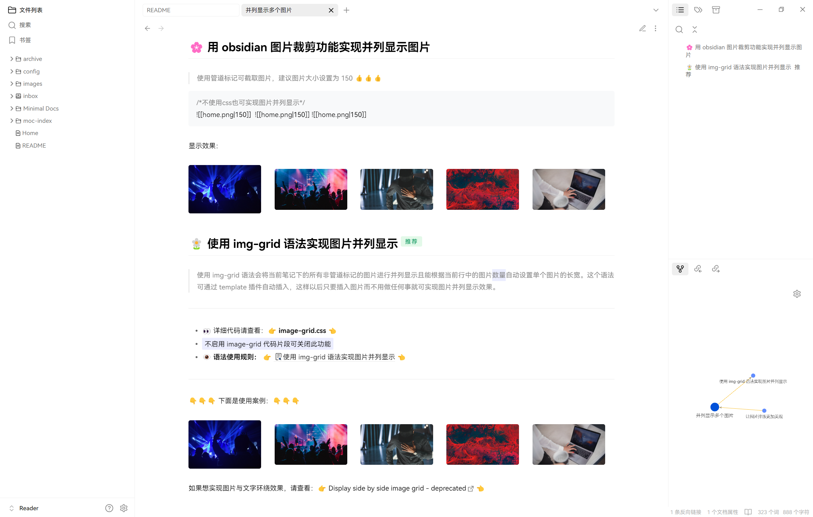
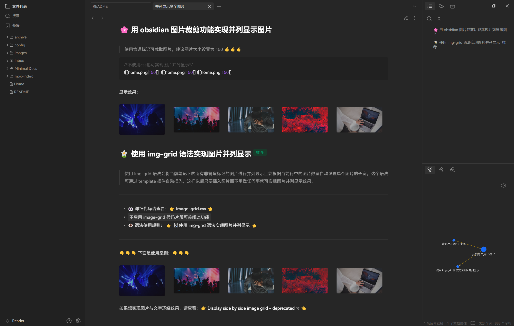

##  🎉  obsidian_orange 是什么？

- obsidian_orange 是一款基于 [obsidian_minimal](https://github.com/kepano/obsidian-minimal) 定制的主题。

##  📝  obsidian_orange 实现了什么功能？

- 多样式“提示块”
- 图片并列显示
- 高亮块 & 文本多颜色高亮
- 徽章（Badge）：在标题或文本的右上角添加状态信息
- 分栏：在 [obsidian-modular-css-layout](https://github.com/efemkay/obsidian-modular-css-layout) 基础上添加了自定义分栏模块

## ⁉  如何使用 ?

- 先去下载 [obsidian_minimal](https://github.com/kepano/obsidian-minimal) 主题并启用该主题
- 下载如下插件:
	- [obsidian-style-settings](https://github.com/mgmeyers/obsidian-style-settings) （必须）
	- obsidian-hider （必须）
	- obsidian-minimal-settings （必须）
	- 可选插件：
		- [obsidian-dataview](https://github.com/blacksmithgu/obsidian-dataview) （推荐安装）
		- Excalidraw （推荐安装）
- 下载 obsidian_orange 示例库并启用该示例库 `.obsidian/snippets` 里的 `obsidian_orange.css` 代码片段

> [!info] 用 obsidian 打开本项目， 仔细阅读 `Start Here` 文件，想查看具体语法可打开 `编辑模式`。

##  📅 更新日志

- 2024/9/21：注æ„：此次更新å¯èƒ½ä¼šå¯¼è‡´ä¸€äº›æ ·å¼æ— æ³•æ˜¾ç¤ºï¼Œè¯·è°¨æ…更新。
	- **适配了 Obsidian V1.6.7**
	- 插件及主题更新：
		- 升级 Minimal 主题为: 8.1.1
		- MCL Multi Column.css 更新到了 0.10.0
	- 源码优化:  
		- 目录结构：依照 Minimal 主题目录结构进行调整
		- **代码精简：删除了重复的样式定义（主要涉及分栏、高亮块以及 callout）以及非必须的代码**
		- 颜色系统：使用 TDesign 新增了 Design Token 来适配 Light 以及 Dark 下的样式
	- bugFix:
		- table 选中时无法显示表格内容
		- Github Badge 样式错误
		- 编辑视图下 callout 中的 > 符号不显示
		- 文本并列显示样式错误
	- 样式修改：
		- **使用 Style Settings 插件管理主题配色**:  配置文件路径:  `config/style_settings.json` ,可在 Style Settings 插件中导入
		- 界面布局调整：tabs 以及目录树等样式修改
		- callout 精简与样式设计：
			- 重新设计了  `success、info、warning、error、tip`  等默认 Callout 样式
			- **新增了 border callout**
			- **删除了所有以 ob- 开头的 callout**
			- 精简高亮块样式：**删除了所有以 ob-light 开头的高亮块**
- 2024/6/25
	- 支持 Obsidian V1.6.3 及 Obsidian_minimal V7.7.3
	- MCL Multi Column.css 更新到了 0.9.9
- 2024/3/9 
	- 去除了 ` img-grid.css` 以及 `MCL Wide Views.css` ，功能依然可以使用
	- 将多个 CSS 片段合并为 `0bsidian_orange.css`
	- 支持 Obsidian V1.5.8 以及 Obsidian_minimal V7.5.2
	- 修复了一些样式 bug，如：字体样式、表格样式、标题样式、暗黑模式下的配色重定义等

##  ❓ FAQ

- 无法实现与 obsidian_orange 相同的显示效果: 
	- 检查 `.obsidian/snippets` 里的 `obsidian_orange.css` 代码片段是否启用
	- 检查 `config/style_settings.json` 是否导入到 style settings 插件中
	- 参考 `config/image` 文件夹中的图片对 obsidian 进行配置
	- 检查 `.obsidian/plugins` 里的插件配置信息是否复制到 `.obsidian/plugins` 下
	- 是否下载 HarmonyOS Sans SC 以及 JetBrains Mono 字体（非必须）。
	-  **Quick Start: 先下载 obsidian_orange 示例库，再在该库中添加笔记文件。**

## Links

如果你想修改 obsidian_orange 样式，请移步 **[源码地址](https://github.com/iEchoxu/obsidian_orange_src)** ，然后自行编译。

## 🎨  效果预览

Obsidian V1.6.7 效果预览:

### 主页

### 提醒

### 分栏

### 表格

### TODO

### img-grid

### 其它

